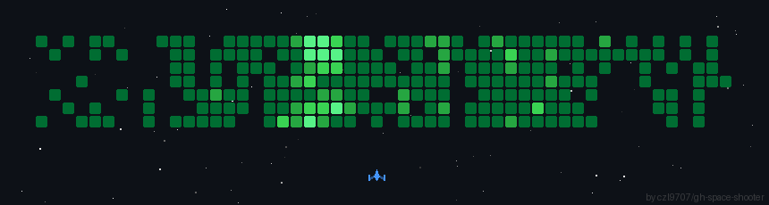

<div align="center">


# ⚡ SHASHANK SINGH

### `BUILD • CREATE • EXPERIMENT • REPEAT`

**Student Developer · Builder · Designer · Problem Solver**

<br>

<a href="https://github.com/sh4shanks">
  
</a>

<a href="https://github.com/sh4shanks?tab=repositories">
  
</a>

</div>

---

# 🎮 CONTRIBUTION ARCADE

> **Every contribution is another move. Every project is another level.**

<div align="center">


</div>

<br>

<div align="center">

`🟡 START` ───────── `🟢 BUILD` ───────── `🔵 EXPERIMENT` ───────── `🔴 SHIP`

</div>

---

# 🚀 SPACE SIGNAL

<div align="center">



<br><br>

### `MISSION STATUS: ONLINE`

`BUILDING` • `EXPERIMENTING` • `LEARNING` • `SHIPPING`

</div>

---

# 👨‍💻 ABOUT ME

I'm a student developer who enjoys turning **crazy ideas into working software**.

I like experimenting with:

- 🤖 AI applications
- 🌐 Modern web experiences
- 🎮 Games and interactive projects
- 🧠 Intelligent systems
- 🎨 UI/UX and visual design
- 🧪 Experimental technology

I don't just want to write code.

I want to build things that people can **use, explore, and remember.**

```text
┌─────────────────────────────────────────────────────────────┐
│                                                             │
│   SHASHANK SINGH                                            │
│                                                             │
│   > Student Developer                                       │
│   > Building AI & Web Experiences                           │
│   > Exploring Game Development                              │
│   > Designing Interactive Interfaces                        │
│   > Turning Ideas Into Working Products                     │
│                                                             │
│   STATUS: ████████████████████████████████ ONLINE           │
│                                                             │
└─────────────────────────────────────────────────────────────┘
